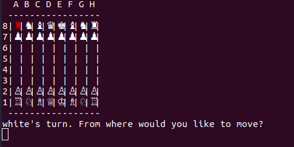

# ETHAN'S CHESS

A simple console implementation of chess built with ruby.

Game structure is divided into several classes and modules. There are classes for the board,
the display, the cursor which uses keymapping to allow WASD movement and piece selection,
the pieces which utilize modules and a superclass, the player, the game itself, and the colorize gem.

The game is rendered in the console with the colorize gem and unicode characters used
to make it look like chess.



Utilizes OOP principles to build the fundamentals of the game of chess in a way that
it can be played between two human players in the terminal. Pieces are built with two superclasses for
both sliding and stepping pieces.  These superclasses handle the base functionality of the movement,
which is then pared down in the classes to represent the various chess pieces.

```ruby
class Queen < Piece
  include SlidingPiece

  def symbol
    :Q
  end

  def to_s
    if self.color == :white
      "\u{2655}"
    elsif self.color == :black
      "\u{265B}"
    end
  end

  protected

  def move_dirs
    HORIZONTAL_DIRS + DIAGONAL_DIRS
  end

end
```

Computer players are implemented in a number of ways ascending in complexity.  The most basic
simply selects from all available moves, but ascending difficulties provide more complex means of
move generation for the computer player.
